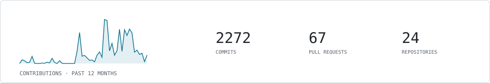

<picture>
  <source media="(prefers-color-scheme: dark)" srcset="assets/header-dark.svg">
  
</picture>

I build control systems and scientific software for synchrotron beamlines at the Advanced Light Source. My work spans beamline control UIs, autonomous experiment orchestration, and the infrastructure that keeps instruments and their software reproducible.

## Projects

- [**Lightfall**](https://github.com/als-controls/lightfall) — A modern, unified control system for synchrotron lightsource facilities — plugin-based, built for operators and scientists alike.
- **CSM** — Configuration management API for beamline control systems — declarative IOC provisioning across the facility. *(internal)*
- [**Xi-CAM**](https://github.com/Xi-CAM/Xi-cam) — Extensible platform for synchrotron data reduction, visualization, and management.
- [**Tsuchinoko**](https://github.com/lbl-camera/tsuchinoko) — Adaptive-experiment Qt application driving gpCAM autonomous measurement.
- [**gpCAM**](https://github.com/lbl-camera/gpCAM) — Autonomous experimentation and uncertainty quantification engine (CAMERA).
- [**fvGP**](https://github.com/lbl-camera/fvGP) — Flexible HPC Gaussian processes — the GP engine under gpCAM.
- [**HGDL**](https://github.com/lbl-camera/HGDL) — Distributed HPC function optimization.
- [**Ascribe-XR / Ascribe-Link**](https://github.com/lbl-camera/Ascribe-XR) — Scientific data visualization in VR (Godot 4 + OpenXR), with an HTTP specimen server for meshes, volumes, and point clouds.
- **Catalux** — Beamline Controls Group hardware-inventory webapp — searchable catalog of equipment models, units, and specs. *(internal)*
- **IOCular** — IOC management agent for EPICS control systems — remote monitoring, control, log streaming, and deployment. *(internal)*
- [**bcsophyd-zmq**](https://github.com/ronpandolfi/bcsophyd-zmq) — LabVIEW ↔ Bluesky bridge over ZMQ for legacy beamline control integration.

<picture>
  <source media="(prefers-color-scheme: dark)" srcset="assets/activity-dark.svg">
  
</picture>

## Selected publications

- Xi-cam: a versatile interface for data visualization and analysis — *Journal of Synchrotron Radiation*, 2018 · cited 108×
- Quantum dot/liquid crystal composite materials: self-assembly driven by liquid crystal phase transition templating — *Journal of Materials Chemistry C*, 2013 · cited 84×
- Tuning Quantum-Dot Organization in Liquid Crystals for Robust Photonic Applications — *ChemPhysChem*, 2014 · cited 59×
- Self-assembled nanoparticle micro-shells templated by liquid crystal sorting — *Soft Matter*, 2015 · cited 34×
- Benchmarking topic models on scientific articles using BERTeley — *Natural Language Processing Journal*, 2024 · cited 26×

[see all on Google Scholar](https://scholar.google.com/citations?user=HilPbaoAAAAJ)

---

[ORCID](https://orcid.org/0000-0003-0824-8548) · [Google Scholar](https://scholar.google.com/citations?user=HilPbaoAAAAJ) · [LinkedIn](https://www.linkedin.com/in/ronald-pandolfi-39216435) · this page regenerated itself on 2026-08-17 via [GitHub Actions](scripts/build.py)
